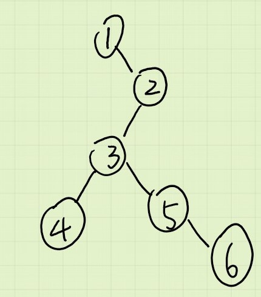
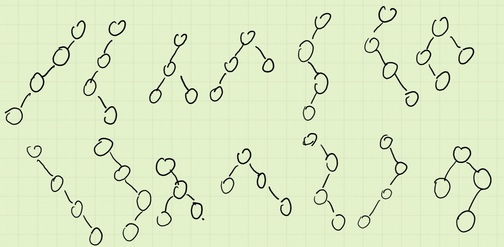
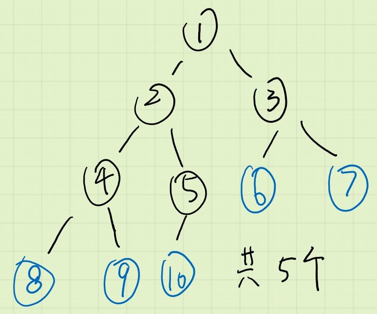
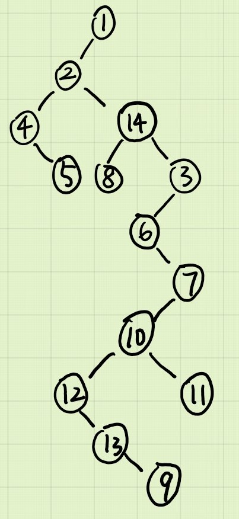
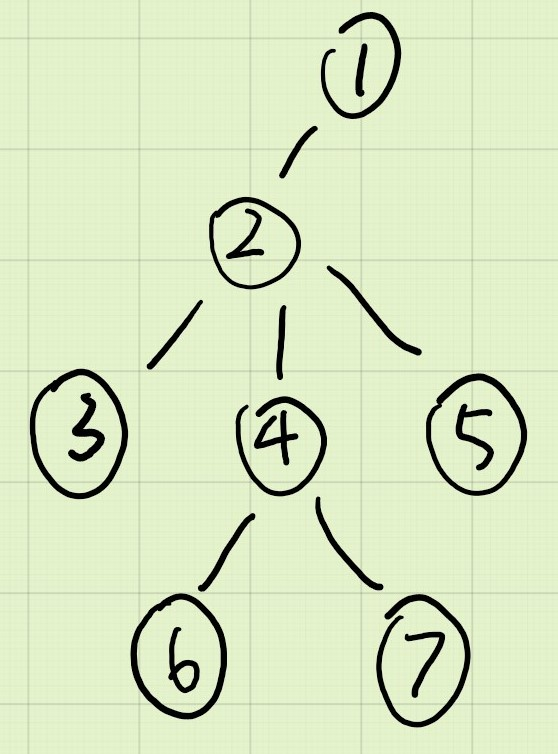

1. 设有一棵叉树，它的中序和前序遍例结果如下，请画出该二叉树。
    * 中序：1 4 3 5 6 2
    * 后序：4 6 5 3 2 1
    * 
2. 请画出具有四个结点的各种不同构的有序二叉树。
    * 
3. 设一棵顺序二叉树具有 10 个结点，请计算其中叶子结点的数目。
    * 
4. 设有如下所示的一棵树，请将其转化为二叉树。
    * 
5. 设下列二叉树是有某棵树转化而来，请画出其对应的原树。
    * 
