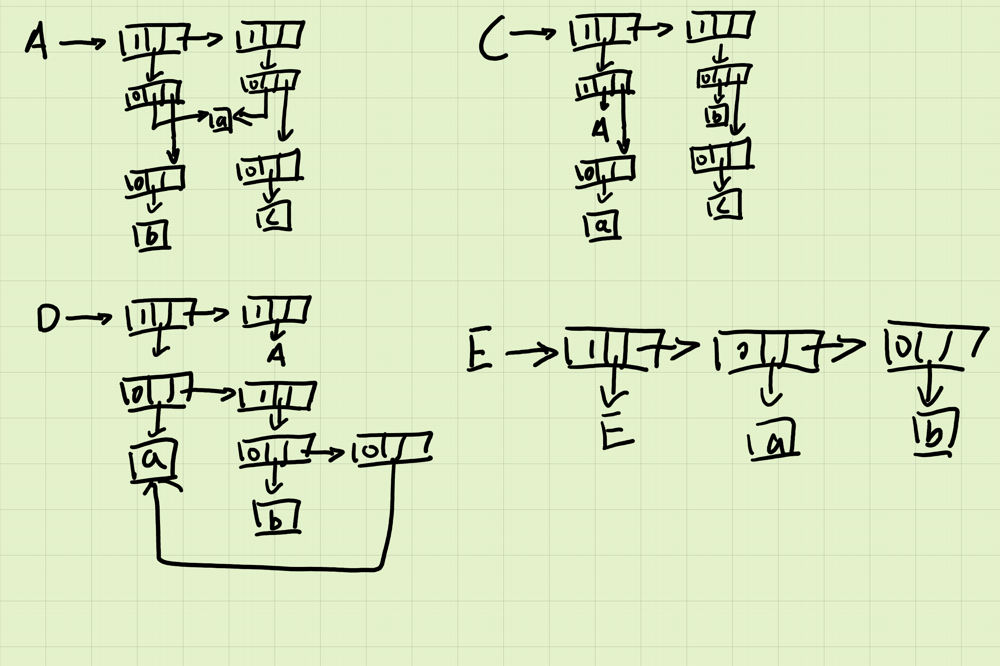
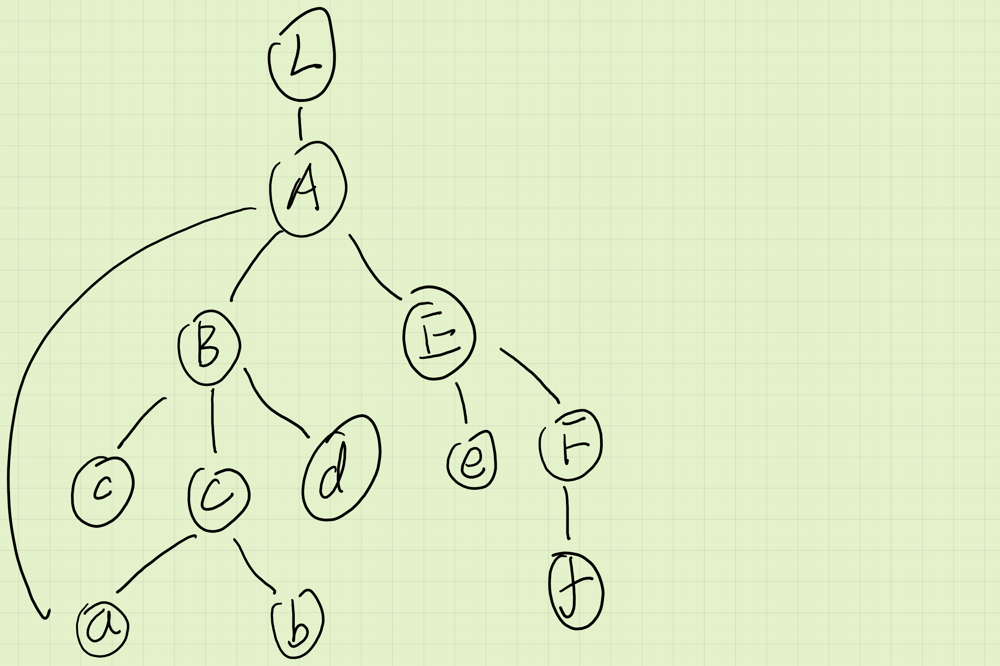

1. 对下列广义表系列，分别求出它们的长度、深度、头、尾，并画出存贮结构图（同名元素或表共享，小写字母为单元素）
    1. A=((a,b), (a,c))
        * 长度: 2
        * 深度: 2
        * 头: (a,b)
        * 尾: ((a,c))
    2. c=((A,a), (b,c))
        * 长度: 2
        * 深度: 4
        * 头: (A,a)
        * 尾: ((b,c))
    3. D=((a, (b,a)), A)
        * 长度: 2
        * 深度: 3
        * 头: (a, (b,a))
        * 尾: (A)
    4. E=(E, a, b)
        * 长度: 3
        * 深度: inf
        * 头: E
        * 尾: (a,b)
    * 存贮结构图: 

2. 请通过 GetHead()和 GetTail()操作，将下列各表中的 apple 分离出来。
    1. A1 = (banana, pear, orange, (apple))
        * GetTail(), GetTail(), GetTail(), GetHead(), GetHead()
    2. A2 = ((apple, pear), orange)
        * GetHead(), GetHead()
    3. A2 = (pear, (peach, (plum, apple), fig), apple, date)
        * GetTail(), GetTail(), GetHead()
        
3. 画出 L=A(a, B(c, C(a, b), d), E(e,F(f)) )的广义表图，并分别给出其深度优先和广度优先遍历结果。
    * 广义表: 
    * 深度优先遍历: L A a B c C b d E e F f
    * 广度优先遍历: L A a B E c C d e F b f
