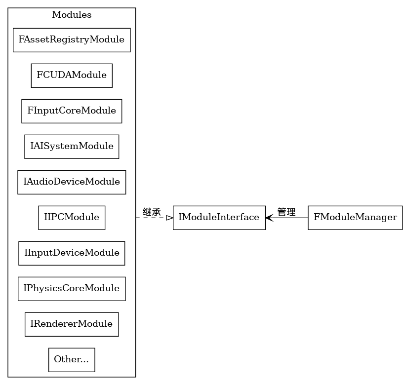

### files
- [ModuleManager.h](../UnrealEngine/Engine/Source/Runtime/Core/Public/Modules/ModuleManager.h) Line 112
- [ModuleInterface.h](../UnrealEngine/Engine/Source/Runtime/Core/Public/Modules/ModuleInterface.h) Line 13
- [IInputDeviceModule.h](../UnrealEngine/Engine/Source/Runtime/InputDevice/Public/IInputDeviceModule.h) Line 15

### relationship
